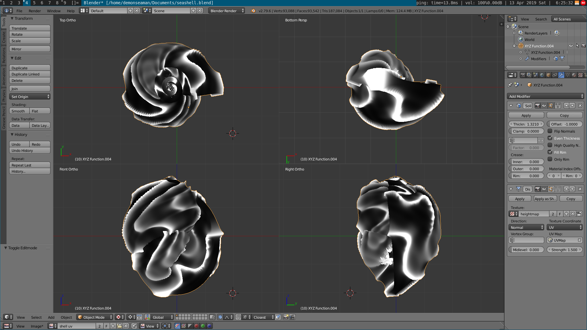

# 3d Print Seashells

## Goal:

The goal of this project was to generate a model of [Hexaplex
Radix](https://en.wikipedia.org/wiki/Hexaplex_radix) and 3D print it.

### Model:

## POV Ray

Initially the idea was to use a ray tracer to render [implicit
surfaces](https://en.wikipedia.org/wiki/Implicit_surface).

`povray/` contains code that can be run using
[POVRay](http://povray.org/).

`povray/shells` contains code from
http://www.econym.demon.co.uk/isotut/shells.htm

## Blender

`blender/` contains the script `blender_seashell.py` which is based
on this [paper by Jorge
Picado](http://www.mat.uc.pt/~picado/conchas/eng/article.pdf). Using
that I fiddle around with the equation until I got a model that
resembles hexaplex radix.

The directory also contains the UV mapping of the shell onto the
reaction-diffusion texture.

## Shaders

`shaders/` contains some fragment shaders used in [Shader
Toy](https://www.shadertoy.com) to generate the model's height map.

[Fractal Brownian Motion](https://www.shadertoy.com/view/wdSXD3)

[Reaction Diffusion](https://www.shadertoy.com/view/3sjXzd)

[Reaction Diffusion + FBM](https://www.shadertoy.com/view/tsjSz3)

## STL

`stl/` contains the `.stl` files of the models generated.

## Related:

### Seashell Generator

I forked a [Processing](https://processing.org/) based [Seashell
Generator](https://github.com/hahahahaman/SeashellGenerator), which
I've update to work with Processing 3, but it remains buggy.
